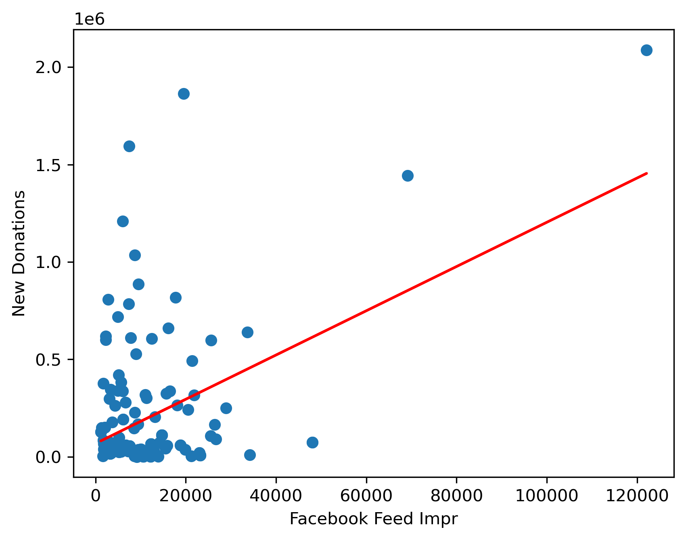

Data Science Projects
Examples of analytics work

## Marketing Mixed Model 

The objective was to view the effects of each marketing channel on sales, and on each other. For instance, is radio affecting all the other channels, and is it affecting sales?
[Full Project](https://github.com/kevinedw/MMM)

## Business KPI dashboard
Create a dashboard that displays core business KPIs on a weekly, monthly, and yearly basis. 

[Full Project](https://github.com/kevinedw/Executive-Dashboard)

## Marketing Channel Correlations

Plot the correlations for each marketing channel compared to Sales

